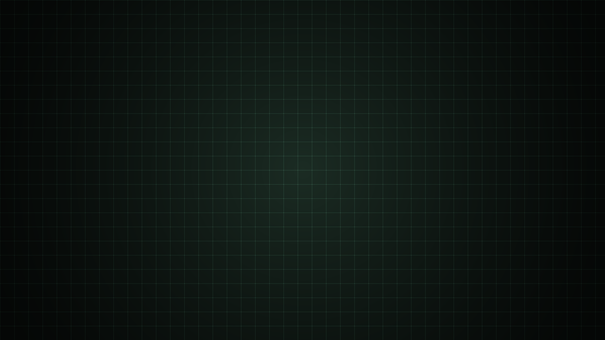
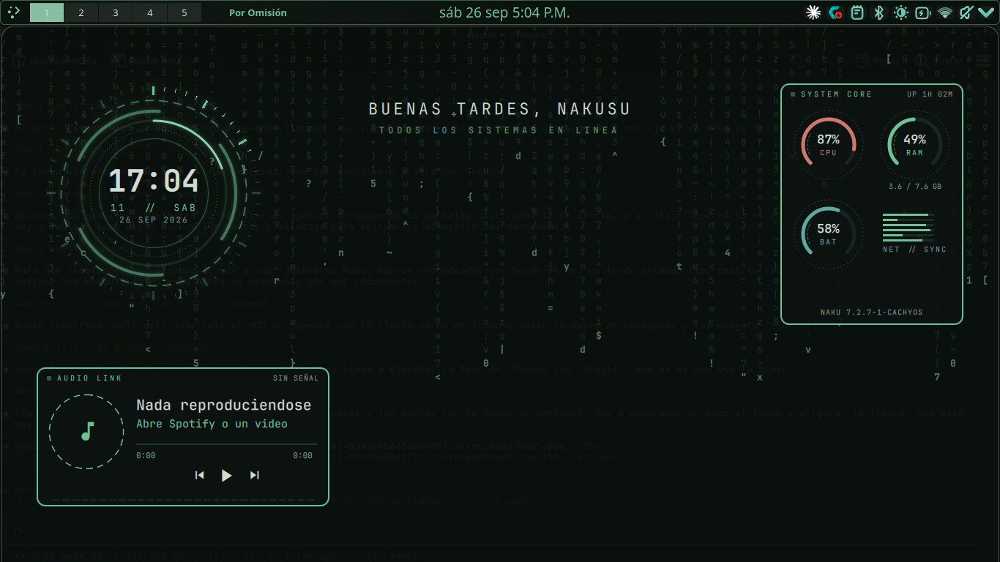
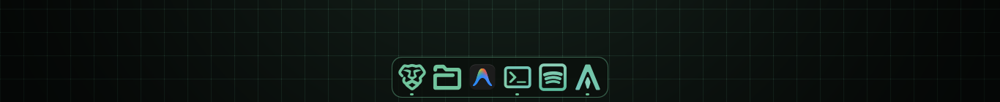

# Dotfiles — KDE Plasma "Verde Tech"

Mi rice de KDE Plasma 6 (CachyOS, Wayland) con aspecto tipo Hyprland: paleta verde apagada, ventanas en mosaico y un dashboard de terminales.



## Qué incluye

- **Colores:** esquema `VerdeTech` (y la demo `RojoTech`) para KDE, Konsole, Alacritty, btop, cava, fastfetch y fuzzel.
- **Mosaico:** Krohnkite con huecos de 10 px, esquinas redondeadas y 5 escritorios.
- **Dashboard:** `dashboard.sh` abre btop, reloj, cmatrix y pipes en mosaico con Super+Shift+M (ya no arranca solo al iniciar sesión, para no gastar CPU).
- **Cambio de tema:** `tema.sh verde` o `tema.sh rojo`.
- **Dock (Quickshell):** efecto lupa estilo Mac, se esconde cuando una ventana lo tapa. Ver abajo.
- **HUD (Super+A):** reloj reactor, sistema y música sobre una lluvia tipo cmatrix, con estética cyberpunk 2000: ventanas tipo Windows 98, pantalla de videocámara de visión nocturna (REC en rojo) y un 警告 WARNING que salta solo si la batería, la CPU o la RAM están mal. Esc o clic para cerrar.
- **Fondos cyberpunk 2000 / Fallen Angels:** `fondo-y2k.py` convierte cualquier imagen en un fondo de visión nocturna con VHS y pantalla de videocámara. `bloqueo-video.sh` pone un GIF o video en la pantalla de bloqueo. Ver abajo.

## HUD



## Dock



Dock propio hecho con Quickshell en `.config/quickshell/dock` (arranca con `qs -c dock`):

- **Efecto lupa:** el ícono bajo el cursor crece y los vecinos crecen un poco menos, como en macOS.
- **Apps abiertas:** un punto debajo; una raya más larga si está al frente.
- **Clic:** abre la app o la trae al frente; si ya está al frente, pasa a su siguiente ventana. **Clic central:** abre otra ventana.
- **Se esconde** si una ventana lo tapa; aparece al llevar el cursor al borde de abajo.
- Las apps fijadas se cambian en la lista `fijadas` de `shell.qml`.

KWin no le da a Quickshell la lista de ventanas, así que `ventanas.js` (un script de KWin) la envía por DBus a `puente.py`, que se la pasa al dock.

## Atajos

| Atajo | Qué hace |
|---|---|
| Super + flechas | Mover la ventana dentro del mosaico |
| Super + Shift + flechas / Super + H J K L | Cambiar de ventana |
| Super + Shift + Enter | Hacer esta ventana la principal |
| Super + Ctrl + H / L / K / J | Cambiar el tamaño |
| Super + F | Soltar la ventana del mosaico o volver a meterla |
| Super + D | Lanzador (fuzzel) |
| Super + Shift + M | Dashboard |
| Super + A | HUD |
| Super + Shift + G | Modo ligero (sin blur, sombras ni animaciones) |

## Fondos cyberpunk 2000

**Escritorio:** cualquier imagen pasa a visión nocturna verde con VHS (colores corridos, grano, scanlines) y la pantalla de videocámara:

```
fondo-y2k.py foto.jpg ~/Imágenes/fondo-y2k.png              # visión nocturna
fondo-y2k.py foto.jpg ~/Imágenes/fondo-y2k.png --ascii      # hecha de caracteres sobre código
fondo-y2k.py foto.jpg ~/Imágenes/fondo-y2k.png --errores    # con ventanas de error y 警告
plasma-apply-wallpaperimage ~/Imágenes/fondo-y2k.png
```

Se pueden juntar (`--ascii --errores`); `--sin-osd` quita los textos de videocámara. Es una imagen fija: no gasta nada.

**Varios fondos que se alternan:** `fondos-y2k.sh` pasa varias fotos (rutas o enlaces) por el filtro y las pone en presentación:

```
fondos-y2k.sh -m 10 foto1.jpg https://.../foto2.jpg     # cambian cada 10 minutos
```

**Pantalla de bloqueo con video o GIF:**

```
bloqueo-video.sh mi-gif.gif
```

Lo pasa a MP4 del tamaño de la pantalla (un GIF lo decodifica la CPU; un MP4, la tarjeta de video) y dice dónde elegirlo. Usa el plugin Smart Video Wallpaper Reborn, que pausa el video con la pantalla apagada. El video va solo en el bloqueo: en el escritorio gastaría todo el rato.

> Si tienes GPU AMD y Plasma se cuelga al usar el plugin, el autor del plugin documenta cómo recuperarlo en su página.

## Programas necesarios

```
paru -S kwin-scripts-krohnkite kwin-effect-rounded-corners-git plasma6-applets-panel-colorizer \
        alacritty btop cava fastfetch fuzzel quickshell cmatrix tty-clock pipes.sh         python-pillow noto-fonts-cjk ffmpeg plasma6-wallpapers-smart-video-wallpaper-reborn
```

### Iconos

**BeautyLine Verde**: los iconos de líneas de [BeautyLine](https://gitlab.com/garuda-linux/themes-and-settings/artwork/beautyline) pasados a la paleta verde. No se suben al repo porque pesan 69 MB; el script los genera:

```
~/.local/bin/iconos-verdes.py
/usr/lib/plasma-changeicons BeautyLine-Verde
```


Para los iconos que BeautyLine no tiene se usa Colloid-Green-Everforest-Dark como respaldo.

## Rendimiento

Pensado para que vaya fluido en una laptop modesta:

- El HUD no existe mientras está cerrado: sus animaciones, la lluvia y las medidas del sistema solo corren con Super+A.
- El dock recibe los cambios de KWin como mucho cada 120 ms al mover o redimensionar ventanas.
- Solo un blur (el efecto `glass`); el blur nativo de KWin y el efecto de transparencia al mover van apagados.
- Animaciones de Plasma a 0.5× (más rápidas).

**Modo ligero (Super+Shift+G):** como el "game mode" de otros rices. Apaga el blur, las sombras y las animaciones para cuando necesitas toda la máquina (juegos, compilar, videollamadas). Otro Super+Shift+G lo devuelve todo. También: `ligero.sh on` / `ligero.sh off`.

Si aún va lenta:

```
balooctl6 disable   # deja de indexar los archivos en segundo plano (Dolphin sigue buscando por nombre)
```

Y en Preferencias → Efectos de escritorio puedes apagar `glass` (pierdes el blur de las terminales, ganas bastante GPU).

## Uso

- **Instalar en un equipo:** `./instalar.sh` (primero respalda lo que haya).
- **Guardar cambios nuevos en GitHub:** `./guardar.sh`
